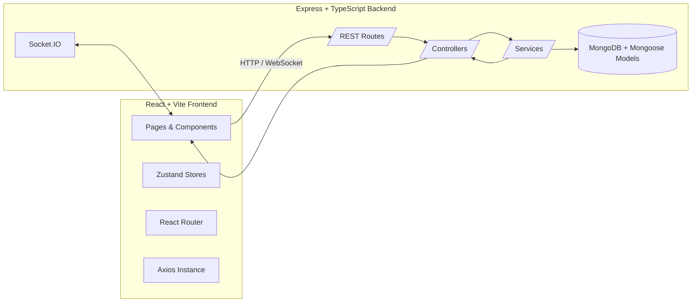
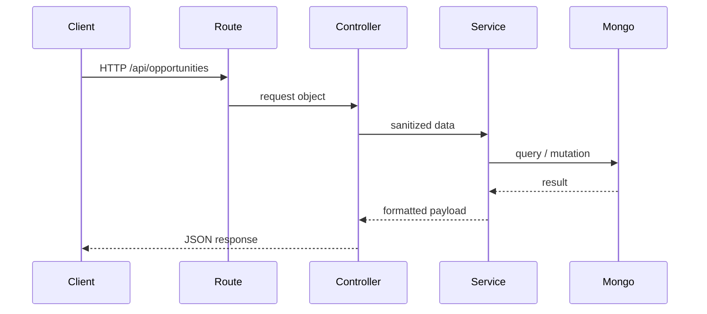

git diff
git status
git diff --staged
git commit -m "Adjust headers and sockets for realtime support"
git push origin main

<div align="center">

# CareerConnect v2 — Project Study Guide 👩‍🎓👨‍💻

Your complete handbook for understanding, building, and interviewing on this full-stack platform.

</div>

---

## 1. Project Overview

| Question                             | Answer                                                                                                                                                                                        |
| ------------------------------------ | --------------------------------------------------------------------------------------------------------------------------------------------------------------------------------------------- |
| **What problem is solved?**          | Universities struggle to keep students, alumni, mentors, and opportunities in a single, curated, real-time hub. CareerConnect v2 unifies networking, messaging, achievements, and job boards. |
| **Why does it exist?**               | To bridge the gap between ambitious students and experienced alumni while giving admins visibility into community health.                                                                     |
| **Who should use or learn from it?** | Product teams building career networks, students learning full-stack patterns, and interviewees needing a concrete portfolio app.                                                             |

**Elevator pitch:** “Think of LinkedIn, but narrowed to your campus, optimized for alumni mentoring, and built with a modern React + Node stack.”

---

## 2. Complete Project Architecture



### Frontend quick map

```
client/
 ├── src/
 │   ├── main.tsx          # Entry (ReactDOM + providers)
 │   ├── router.tsx        # Route definitions + guards
 │   ├── components/       # Reusable UI pieces (atoms → organisms)
 │   ├── pages/            # Feature screens (Feed, Admin, Auth ...)
 │   ├── store/            # Zustand stores (auth, layout, theme)
 │   ├── lib/axios.ts      # Shared Axios instance (token + interceptors)
 │   ├── providers/        # Theme + Socket contexts
 │   └── types/            # Shared TypeScript declarations
```

### Backend quick map

```
server/
 ├── src/
 │   ├── index.ts          # Boots app, connects DB, starts server
 │   ├── server.ts         # Express app wiring, middleware order
 │   ├── config/           # env loading, Mongo connection
 │   ├── controllers/      # Feature logic (auth, posts, opportunities ...)
 │   ├── routes/           # Express routers per domain
 │   ├── middlewares/      # Auth guard, admin guard, error handler
 │   ├── models/           # Mongoose schemas (User, Post, Opportunity ...)
 │   ├── sockets/          # Socket.IO setup
 │   └── utils/            # Helpers (upload, validation, etc.)
```

### Request → response lifecycle

1. UI triggers Axios request using `api` instance.
2. Axios attaches JWT from Zustand store (if available).
3. Express route matches `/api/...` endpoint.
4. Middleware verifies auth → controller runs → service hits MongoDB.
5. Response returns JSON to the frontend.
6. React Query/Zustand update state → UI re-renders.
7. For real-time events, Socket.IO pushes changes back (new posts, unread counts).

### Data flow (textual):

`User input → React component → Axios request → Express route → Controller → Service → MongoDB → Service → Controller → JSON → Axios response → State store → React render`

---

## 3. Frontend Deep Dive

| Topic                        | Explanation                                                                                                                                                                                     |
| ---------------------------- | ----------------------------------------------------------------------------------------------------------------------------------------------------------------------------------------------- |
| **Entry point**              | `main.tsx` creates the React root with providers: React Query, ThemeProvider, Toasts, SocketProvider, Router.                                                                                   |
| **Why components?**          | They isolate UI + logic: atoms (buttons) → molecules (cards) → organisms (dashboards) → pages. Easier to test, reuse, and theme.                                                                |
| **State & props**            | Local UI state via hooks, global state via Zustand stores (`useAuthStore`, `useLayoutStore`, `useThemeStore`). Props flow downward; events bubble upward.                                       |
| **API calls**                | `lib/axios.ts` centralizes headers + 401 logout. Components call `api.get/post/...`; React Query caches results and handles refetch on focus or WebSocket events.                               |
| **Common beginner mistakes** | Forgetting to include dependencies in `useEffect`, mutating props, not handling loading states, calling APIs outside React Query/Zustand causing duplication, or not guarding protected routes. |

**Mini diagram: component data path**

```
User Action
	 ↓ event handler
Component state ──> API call via api.ts ──> setState/useAuthStore
	 ↓ re-render
Updated UI
```

---

## 4. Backend Deep Dive

| Area                       | Details                                                                                                                                                       |
| -------------------------- | ------------------------------------------------------------------------------------------------------------------------------------------------------------- |
| **Boot process**           | `server/src/index.ts` loads env, connects Mongo, starts Express app from `server.ts`. Socket.IO wraps the HTTP server for real-time events.                   |
| **Routing**                | `server.ts` mounts `/api/auth`, `/api/posts`, `/api/opportunities`, etc. Each route file wires HTTP verbs to controllers.                                     |
| **Controllers & services** | Controllers validate input + call services. Services encapsulate business logic and interact with Mongoose models.                                            |
| **Database**               | MongoDB with Mongoose schemas (User, Post, Opportunity, Training, etc.). Relationships via refs to avoid SQL joins.                                           |
| **Auth**                   | JWT-based. `authController` returns token; `authMiddleware` verifies and attaches `req.user`. Admin middleware checks roles.                                  |
| **Error handling**         | Central middleware sends JSON `{message, details}`. Validation middleware surfaces human-friendly messages. Helmet, rate limiter, and CORS protect endpoints. |

**Server flow diagram (simplified):**



---

## 5. End-to-End Execution Flow

**Scenario:** User clicks “Connect” on an alumni card.

1. Button triggers component event → calls `api.post('/connections/request', payload)`.
2. Axios attaches JWT; backend route authenticates user.
3. Connection controller validates target user, ensures no duplicate requests.
4. Service writes connection document in MongoDB.
5. Controller responds with success; React Query updates local state.
6. Socket.IO emits `CONNECTION_UPDATED` to both users to refresh pending counts.

**Real-world analogy:**

> You fill out a paper form (UI) and hand it to a clerk (backend route). The clerk checks your ID (auth middleware), passes the form to a specialist (service) who updates the filing cabinet (database). The clerk tells you the result (JSON response), and a notification light updates for your friend (Socket event).

---

## 6. Development & Execution

| Task           | Command                                                                     |
| -------------- | --------------------------------------------------------------------------- |
| Install deps   | `npm install && npm install --prefix client && npm install --prefix server` |
| Run frontend   | `npm run dev --prefix client` (Vite on 5173)                                |
| Run backend    | `npm run dev --prefix server` (Express on 4000)                             |
| Lint frontend  | `npm run lint --prefix client`                                              |
| Build frontend | `npm run build --prefix client`                                             |
| Build backend  | `npm run build --prefix server`                                             |

### Environment variables

| Location    | Key                                   | Purpose                                                 |
| ----------- | ------------------------------------- | ------------------------------------------------------- |
| client/.env | `VITE_API_URL`                        | Base URL for Axios (e.g., `http://localhost:4000/api`). |
| client/.env | `VITE_GOOGLE_CLIENT_ID`               | Google OAuth button.                                    |
| server/.env | `MONGODB_URI`                         | Mongo connection string.                                |
| server/.env | `JWT_SECRET`                          | Token signing key.                                      |
| server/.env | `CLOUDINARY_*`                        | Upload configuration (if using media).                  |
| server/.env | `ADMIN_SEED_EMAIL`, `ADMIN_SEED_PASS` | For seed scripts.                                       |

### Deployment snapshot

- Frontend: built with Vite → deployed to Netlify (publish `client/dist`).
- Backend: build TypeScript, host via Node server (Render/Heroku/etc.).
- Ensure `VITE_API_URL` points to the deployed server and CORS allows Netlify domain.

---

## 7. Interview Questions (with answers)

### Beginner

1. **What is CareerConnect v2?** — A campus-focused networking platform built with React, Express, and MongoDB to connect students and alumni.
2. **Why separate frontend and backend?** — Frontend handles user experience; backend secures data and business rules. This separation allows independent scaling and clearer responsibilities.
3. **How do we store login state?** — JWT stored in local storage via Zustand persist; Axios reads it per request.

### Intermediate full-stack

1. **Explain the request lifecycle for creating a post.** — UI form → Axios POST `/api/posts` → Auth middleware extracts user → Controller validates → Service saves Post model → returns JSON → React Query invalidates feed cache.
2. **Why use Zustand instead of Redux?** — Lighter API, minimal boilerplate, good for auth/theme toggles. React Query covers server state; Zustand handles simple global UI state.
3. **How are sockets integrated?** — `SocketProvider` creates a Socket.IO client using the same base URL; when auth token changes, it reconnects. Backend emits events when posts, messages, or unread counts update.

### Advanced/system design

1. **How would you scale real-time messaging?** — Use horizontal scaling with Socket.IO adapter (Redis), ensure sticky sessions or use WebSockets behind a load balancer, and offload message persistence to a queue if spikes occur.
2. **What if we need multi-tenancy (multiple universities)?** — Add a Tenant ID to major collections, use indexes on tenant fields, and isolate tenant-specific configuration (themes, allowed routes).
3. **How do you handle search across alumni profiles?** — Add Mongo text indexes or integrate with Elasticsearch/OpenSearch for advanced filtering.

### “Why this approach?” Answers

- **React + Vite:** Fast dev server, ecosystem familiarity, minimal config.
- **Express + Mongo:** Rapid prototype ability, flexible schema for user-generated content.
- **Zustand + React Query:** Split responsibilities between UI state and server state.
- **Socket.IO:** Real-time updates without polling, easy integration with Express server.

### Common traps & how to answer

| Trap question                                 | Safe response                                                                         |
| --------------------------------------------- | ------------------------------------------------------------------------------------- |
| “Why not just use one server for everything?” | Highlight need for modularity, independent deployments, and security boundaries.      |
| “Is WebSocket overkill?”                      | Explain features needing instant updates (new posts, unread counts) vs. slow polling. |
| “What if Mongo is down?”                      | Discuss retry logic, circuit breakers, and user-facing fallback (“Please retry”).     |

---

## 8. Silly but Critical Questions

- **Why frontend & backend separate?** | Like a restaurant: waiters (frontend) talk to customers; chefs (backend) handle the kitchen. Mixing them causes chaos.
- **Why APIs?** | APIs are the menus/rules waiters use to talk to chefs; they prevent random access to the kitchen.
- **Why JSON?** | It’s lightweight, human-readable, and language-agnostic. Both JS frontend and Node backend handle it natively.
- **Why async/await?** | Network/database calls take time. Async lets code wait without freezing the UI/server.
- **What breaks if one layer fails?** | If frontend fails: blank UI. If backend fails: requests error. If DB fails: backend can’t fulfill requests. Observability + graceful fallbacks are essential.

---

## 9. Best Practices & Improvements

| Area        | Suggestions                                                                                                                      |
| ----------- | -------------------------------------------------------------------------------------------------------------------------------- |
| Coding      | Keep components small, use TypeScript generics for API responses, document props.                                                |
| Security    | Rotate JWT secrets, enforce HTTPS, validate inputs on both client + server, add audit logs for admin actions.                    |
| Performance | Code-split large routes, memoize expensive selectors, use indexes on Mongo collections (posts by author, opportunities by tags). |
| Scalability | Containerize services, use environment-specific configs, add CI for lint/test/build, plan for Redis cache (feed, messaging).     |

---

## 10. Summary Cheat Sheet

```
STACK      : React + Vite + Zustand + React Query | Node + Express + Mongo
ENTRY      : client/src/main.tsx | server/src/index.ts
AUTH FLOW  : Login → store JWT → Axios Authorization header → auth middleware → protect route
DATA FLOW  : UI → Axios → Express route → Controller → Service → Mongo → JSON → State → UI
REAL-TIME  : Socket.IO client/provider ↔ server emits POST/CHAT events
DEV COMMANDS: npm run dev --prefix client | npm run dev --prefix server
ENV KEYS   : VITE_API_URL, VITE_GOOGLE_CLIENT_ID, MONGODB_URI, JWT_SECRET, CLOUDINARY_*
```

> **Final reminder:** Treat every question (even “silly” ones) as an opportunity to clarify the mental model. Simplicity wins interviews and accelerates onboarding.

---

Happy hacking, studying, and interviewing! 🚀
