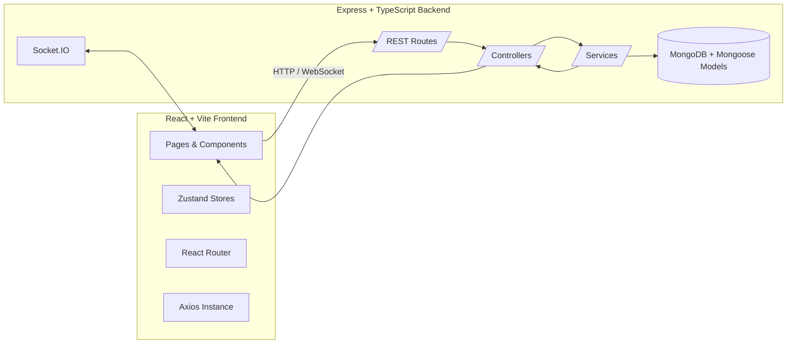
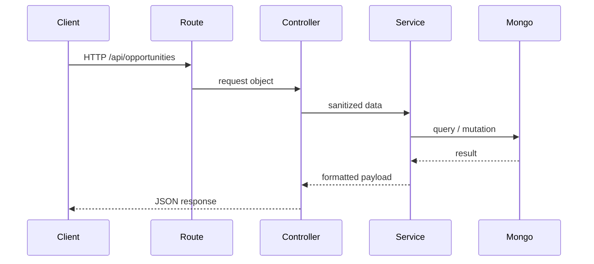

git diff
git status
git diff --staged
git commit -m "Adjust headers and sockets for realtime support"
git push origin main

<div align="center">

# CareerConnect v2 — Project Study Guide 👩‍🎓👨‍💻

Your complete handbook for understanding, building, and interviewing on this full-stack platform.

</div>

---

## 1. Project Overview

| Question                             | Answer                                                                                                                                                                                        |
| ------------------------------------ | --------------------------------------------------------------------------------------------------------------------------------------------------------------------------------------------- |
| **What problem is solved?**          | Universities struggle to keep students, alumni, mentors, and opportunities in a single, curated, real-time hub. CareerConnect v2 unifies networking, messaging, achievements, and job boards. |
| **Why does it exist?**               | To bridge the gap between ambitious students and experienced alumni while giving admins visibility into community health.                                                                     |
| **Who should use or learn from it?** | Product teams building career networks, students learning full-stack patterns, and interviewees needing a concrete portfolio app.                                                             |

**Elevator pitch:** “Think of LinkedIn, but narrowed to your campus, optimized for alumni mentoring, and built with a modern React + Node stack.”

---

## 2. Complete Project Architecture



### Frontend quick map

```
client/
 ├── src/
 │   ├── main.tsx          # Entry (ReactDOM + providers)
 │   ├── router.tsx        # Route definitions + guards
 │   ├── components/       # Reusable UI pieces (atoms → organisms)
 │   ├── pages/            # Feature screens (Feed, Admin, Auth ...)
 │   ├── store/            # Zustand stores (auth, layout, theme)
 │   ├── lib/axios.ts      # Shared Axios instance (token + interceptors)
 │   ├── providers/        # Theme + Socket contexts
 │   └── types/            # Shared TypeScript declarations
```

### Backend quick map

```
server/
 ├── src/
 │   ├── index.ts          # Boots app, connects DB, starts server
 │   ├── server.ts         # Express app wiring, middleware order
 │   ├── config/           # env loading, Mongo connection
 │   ├── controllers/      # Feature logic (auth, posts, opportunities ...)
 │   ├── routes/           # Express routers per domain
 │   ├── middlewares/      # Auth guard, admin guard, error handler
 │   ├── models/           # Mongoose schemas (User, Post, Opportunity ...)
 │   ├── sockets/          # Socket.IO setup
 │   └── utils/            # Helpers (upload, validation, etc.)
```

### Request → response lifecycle

1. UI triggers Axios request using `api` instance.
2. Axios attaches JWT from Zustand store (if available).
3. Express route matches `/api/...` endpoint.
4. Middleware verifies auth → controller runs → service hits MongoDB.
5. Response returns JSON to the frontend.
6. React Query/Zustand update state → UI re-renders.
7. For real-time events, Socket.IO pushes changes back (new posts, unread counts).

### Data flow (textual):

`User input → React component → Axios request → Express route → Controller → Service → MongoDB → Service → Controller → JSON → Axios response → State store → React render`

---

## 3. Frontend Deep Dive

| Topic                        | Explanation                                                                                                                                                                                     |
| ---------------------------- | ----------------------------------------------------------------------------------------------------------------------------------------------------------------------------------------------- |
| **Entry point**              | `main.tsx` creates the React root with providers: React Query, ThemeProvider, Toasts, SocketProvider, Router.                                                                                   |
| **Why components?**          | They isolate UI + logic: atoms (buttons) → molecules (cards) → organisms (dashboards) → pages. Easier to test, reuse, and theme.                                                                |
| **State & props**            | Local UI state via hooks, global state via Zustand stores (`useAuthStore`, `useLayoutStore`, `useThemeStore`). Props flow downward; events bubble upward.                                       |
| **API calls**                | `lib/axios.ts` centralizes headers + 401 logout. Components call `api.get/post/...`; React Query caches results and handles refetch on focus or WebSocket events.                               |
| **Common beginner mistakes** | Forgetting to include dependencies in `useEffect`, mutating props, not handling loading states, calling APIs outside React Query/Zustand causing duplication, or not guarding protected routes. |

**Mini diagram: component data path**

```
User Action
	 ↓ event handler
Component state ──> API call via api.ts ──> setState/useAuthStore
	 ↓ re-render
Updated UI
```

---

## 4. Backend Deep Dive

| Area                       | Details                                                                                                                                                       |
| -------------------------- | ------------------------------------------------------------------------------------------------------------------------------------------------------------- |
| **Boot process**           | `server/src/index.ts` loads env, connects Mongo, starts Express app from `server.ts`. Socket.IO wraps the HTTP server for real-time events.                   |
| **Routing**                | `server.ts` mounts `/api/auth`, `/api/posts`, `/api/opportunities`, etc. Each route file wires HTTP verbs to controllers.                                     |
| **Controllers & services** | Controllers validate input + call services. Services encapsulate business logic and interact with Mongoose models.                                            |
| **Database**               | MongoDB with Mongoose schemas (User, Post, Opportunity, Training, etc.). Relationships via refs to avoid SQL joins.                                           |
| **Auth**                   | JWT-based. `authController` returns token; `authMiddleware` verifies and attaches `req.user`. Admin middleware checks roles.                                  |
| **Error handling**         | Central middleware sends JSON `{message, details}`. Validation middleware surfaces human-friendly messages. Helmet, rate limiter, and CORS protect endpoints. |

**Server flow diagram (simplified):**



---

## 5. End-to-End Execution Flow

**Scenario:** User clicks “Connect” on an alumni card.

1. Button triggers component event → calls `api.post('/connections/request', payload)`.
2. Axios attaches JWT; backend route authenticates user.
3. Connection controller validates target user, ensures no duplicate requests.
4. Service writes connection document in MongoDB.
5. Controller responds with success; React Query updates local state.
6. Socket.IO emits `CONNECTION_UPDATED` to both users to refresh pending counts.

**Real-world analogy:**

> You fill out a paper form (UI) and hand it to a clerk (backend route). The clerk checks your ID (auth middleware), passes the form to a specialist (service) who updates the filing cabinet (database). The clerk tells you the result (JSON response), and a notification light updates for your friend (Socket event).

---

## 6. Development & Execution

| Task           | Command                                                                     |
| -------------- | --------------------------------------------------------------------------- |
| Install deps   | `npm install && npm install --prefix client && npm install --prefix server` |
| Run frontend   | `npm run dev --prefix client` (Vite on 5173)                                |
| Run backend    | `npm run dev --prefix server` (Express on 4000)                             |
| Lint frontend  | `npm run lint --prefix client`                                              |
| Build frontend | `npm run build --prefix client`                                             |
| Build backend  | `npm run build --prefix server`                                             |

### Environment variables

| Location    | Key                                   | Purpose                                                 |
| ----------- | ------------------------------------- | ------------------------------------------------------- |
| client/.env | `VITE_API_URL`                        | Base URL for Axios (e.g., `http://localhost:4000/api`). |
| client/.env | `VITE_GOOGLE_CLIENT_ID`               | Google OAuth button.                                    |
| server/.env | `MONGODB_URI`                         | Mongo connection string.                                |
| server/.env | `JWT_SECRET`                          | Token signing key.                                      |
| server/.env | `CLOUDINARY_*`                        | Upload configuration (if using media).                  |
| server/.env | `ADMIN_SEED_EMAIL`, `ADMIN_SEED_PASS` | For seed scripts.                                       |

### Deployment snapshot

- Frontend: built with Vite → deployed to Netlify (publish `client/dist`).
- Backend: build TypeScript, host via Node server (Render/Heroku/etc.).
- Ensure `VITE_API_URL` points to the deployed server and CORS allows Netlify domain.

---

## 7. Interview Questions (with answers)

### Beginner

1. **What is CareerConnect v2?** — A campus-focused networking platform built with React, Express, and MongoDB to connect students and alumni.
2. **Why separate frontend and backend?** — Frontend handles user experience; backend secures data and business rules. This separation allows independent scaling and clearer responsibilities.
3. **How do we store login state?** — JWT stored in local storage via Zustand persist; Axios reads it per request.

### Intermediate full-stack

1. **Explain the request lifecycle for creating a post.** — UI form → Axios POST `/api/posts` → Auth middleware extracts user → Controller validates → Service saves Post model → returns JSON → React Query invalidates feed cache.
2. **Why use Zustand instead of Redux?** — Lighter API, minimal boilerplate, good for auth/theme toggles. React Query covers server state; Zustand handles simple global UI state.
3. **How are sockets integrated?** — `SocketProvider` creates a Socket.IO client using the same base URL; when auth token changes, it reconnects. Backend emits events when posts, messages, or unread counts update.

### Advanced/system design

1. **How would you scale real-time messaging?** — Use horizontal scaling with Socket.IO adapter (Redis), ensure sticky sessions or use WebSockets behind a load balancer, and offload message persistence to a queue if spikes occur.
2. **What if we need multi-tenancy (multiple universities)?** — Add a Tenant ID to major collections, use indexes on tenant fields, and isolate tenant-specific configuration (themes, allowed routes).
3. **How do you handle search across alumni profiles?** — Add Mongo text indexes or integrate with Elasticsearch/OpenSearch for advanced filtering.

### “Why this approach?” Answers

- **React + Vite:** Fast dev server, ecosystem familiarity, minimal config.
- **Express + Mongo:** Rapid prototype ability, flexible schema for user-generated content.
- **Zustand + React Query:** Split responsibilities between UI state and server state.
- **Socket.IO:** Real-time updates without polling, easy integration with Express server.

### Common traps & how to answer

| Trap question                                 | Safe response                                                                         |
| --------------------------------------------- | ------------------------------------------------------------------------------------- |
| “Why not just use one server for everything?” | Highlight need for modularity, independent deployments, and security boundaries.      |
| “Is WebSocket overkill?”                      | Explain features needing instant updates (new posts, unread counts) vs. slow polling. |
| “What if Mongo is down?”                      | Discuss retry logic, circuit breakers, and user-facing fallback (“Please retry”).     |

---

## 8. Silly but Critical Questions

- **Why frontend & backend separate?** | Like a restaurant: waiters (frontend) talk to customers; chefs (backend) handle the kitchen. Mixing them causes chaos.
- **Why APIs?** | APIs are the menus/rules waiters use to talk to chefs; they prevent random access to the kitchen.
- **Why JSON?** | It’s lightweight, human-readable, and language-agnostic. Both JS frontend and Node backend handle it natively.
- **Why async/await?** | Network/database calls take time. Async lets code wait without freezing the UI/server.
- **What breaks if one layer fails?** | If frontend fails: blank UI. If backend fails: requests error. If DB fails: backend can’t fulfill requests. Observability + graceful fallbacks are essential.

---

## 9. Best Practices & Improvements

| Area        | Suggestions                                                                                                                      |
| ----------- | -------------------------------------------------------------------------------------------------------------------------------- |
| Coding      | Keep components small, use TypeScript generics for API responses, document props.                                                |
| Security    | Rotate JWT secrets, enforce HTTPS, validate inputs on both client + server, add audit logs for admin actions.                    |
| Performance | Code-split large routes, memoize expensive selectors, use indexes on Mongo collections (posts by author, opportunities by tags). |
| Scalability | Containerize services, use environment-specific configs, add CI for lint/test/build, plan for Redis cache (feed, messaging).     |

---

## 10. Summary Cheat Sheet

```
STACK      : React + Vite + Zustand + React Query | Node + Express + Mongo
ENTRY      : client/src/main.tsx | server/src/index.ts
AUTH FLOW  : Login → store JWT → Axios Authorization header → auth middleware → protect route
DATA FLOW  : UI → Axios → Express route → Controller → Service → Mongo → JSON → State → UI
REAL-TIME  : Socket.IO client/provider ↔ server emits POST/CHAT events
DEV COMMANDS: npm run dev --prefix client | npm run dev --prefix server
ENV KEYS   : VITE_API_URL, VITE_GOOGLE_CLIENT_ID, MONGODB_URI, JWT_SECRET, CLOUDINARY_*
```

> **Final reminder:** Treat every question (even “silly” ones) as an opportunity to clarify the mental model. Simplicity wins interviews and accelerates onboarding.

---

Happy hacking, studying, and interviewing! 🚀

---

## 11. Senior MERN Interview Deep Dive

### 1️⃣ Project Initialization & Setup

| Interview Prompt             | Model Answer                                                                                                                                                                             |
| ---------------------------- | ---------------------------------------------------------------------------------------------------------------------------------------------------------------------------------------- |
| **Why MERN + TypeScript?**   | MongoDB pairs naturally with document-centric alumni data, Express + Node keeps backend JS-native, React dominates hiring pipelines, and TypeScript enforces contracts across the stack. |
| **Why split client/server?** | Independent deployability, clearer security boundaries, and the ability to autoscale hotspots (feed read-heavy, messaging write-heavy) without dragging the entire stack.                |
| **Why npm here?**            | The repo already targets Netlify/Render where npm is pre-installed; keeping one tool avoids pnpm lock compatibility issues and simplifies onboarding scripts and CI.                     |

**CLI lifecycle**

```
Developer → npm init → generates package.json contracts
				→ npm install → resolves dependency graph, writes package-lock
				→ npm run dev → spawns Vite/ts-node, compiles TS in-memory, hot-reloads
```

**Tooling roles**

- `package.json` declares entry scripts (`dev`, `build`, `lint`) and dependency versions for both [client/package.json](client/package.json) and [server/package.json](server/package.json).
- `tsconfig.json` files describe compiler targets, path aliases, and strictness, ensuring the server emits CommonJS under [server/tsconfig.json](server/tsconfig.json) while the client aligns with Vite under [client/tsconfig.json](client/tsconfig.json).
- `.env` files load secrets (JWT, Mongo URI, `VITE_*` keys) that must never ship to Git; `.gitignore` ensures build artifacts, `node_modules`, and persisted auth state stay out of commits.

**Flow diagram: dev command to runtime**

```
Developer
	↓ issues `npm run dev --prefix client`
CLI → npm script resolver
	↓ spawns Vite + esbuild
Toolchain → transpiles TSX, injects env vars, serves on 5173
	↓ HMR bundles
Browser runtime → downloads ESM modules, hydrates React tree, opens socket
```

### 2️⃣ Frontend (React + TypeScript)

**Components 101**

- A React component is a pure function from props/state → UI. The repo exclusively uses functional components with hooks for predictable lifecycle (`useEffect`, `useMemo`).
- Components act as the smallest testable surface; React’s reconciliation re-renders only the subtree touched by state changes.

**Atomic Design Stack**

```
Button (Atom)
	↓ reused inside
Form controls (Molecule)
	↓ composed into
LoginSection (Organism)
	↓ wrapped by
LoginPage (Template/Page)
```

Skipping this hierarchy bloats files, produces prop drilling tangles, and blocks reuse in dashboards such as [client/src/pages/FeedPage.tsx](client/src/pages/FeedPage.tsx).

**State Management**

- **Props vs state:** props = inputs, immutable at the component level; state = mutable data owned by the component or store.
- **Zustand usage:** `useAuthStore` persists JWT + user, `useLayoutStore` handles responsive chrome, `useThemeStore` syncs theming.
- **Common pitfalls:** deriving state from props without memoization, mutating arrays in place, forgetting to unsubscribe from sockets in `useEffect` cleanup.

**Folder Rationale**

```
src/
├─ components/  → atomic UI bricks
├─ pages/       → route-level containers with data fetching
├─ hooks/       → shared logic (hydration, sockets)
├─ lib/         → axios instance, utilities
├─ store/       → Zustand slices
├─ providers/   → cross-cutting contexts (theme, socket)
├─ types/       → DTOs + inferred API shapes
├─ styles/      → Tailwind entry + global CSS
```

Collapsing everything into one folder hides ownership boundaries, hurts tree-shaking, and slows code review because unrelated concerns (UI + network + state) cohabitate.

### 3️⃣ Backend (Node + Express + TypeScript)

**Request journey**

```
Client
	↓ HTTP /api/opportunities
Router (Express) → matches path
	↓
Middleware stack (helmet → rateLimiter → auth)
	↓
Controller → validates DTO
	↓
Service → orchestrates business rules
	↓
Model (Mongoose) → MongoDB
	↓
Response formatter → JSON payload
```

**Layered roles**

- **Controller:** translate HTTP to service calls (e.g., [server/src/controllers/opportunityController.ts](server/src/controllers/opportunityController.ts)).
- **Service:** enforce business policies, compose models.
- **Repository (Mongoose model):** persistence logic via schemas and indexes.

**REST discipline**

| Verb      | Usage in project               | Interview-ready framing                       |
| --------- | ------------------------------ | --------------------------------------------- |
| GET       | Fetch feed, messages           | Safe, idempotent, cacheable                   |
| POST      | Create posts, send messages    | Non-idempotent, returns 201                   |
| PUT/PATCH | Update profiles, opportunities | Idempotent updates; patch = partial           |
| DELETE    | Remove connections, posts      | Idempotent deletions confirmed via status 204 |

Status codes follow the triad: 2xx success, 4xx client issues (validation/auth), 5xx server faults surfaced via the error handler at [server/src/middlewares/errorHandler.ts](server/src/middlewares/errorHandler.ts).

### 4️⃣ Database (MongoDB)

- Mongo’s document model matches polymorphic alumni data (skills array, achievements list) without migrations.
- Collections = tables; documents = flexible rows. Schemas (Mongoose) still enforce shape and indexes.
- **Indexing:** email unique index for Users, compound indexes for `opportunities` on status + tags to accelerate dashboards.

```
User Collection
├─ _id: ObjectId
├─ email: string (unique)
├─ passwordHash: string
├─ role: enum('student','alumni','admin')
├─ achievements: [{ title, issuedBy, year }]
├─ createdAt / updatedAt
```

Without indexes, queries like “show all connections for alumni X” degrade to collection scans at O(n) per request.

### 5️⃣ TypeScript Deep Dive

- **Why TS?** Static analysis locks types across the monorepo. Shared DTOs in [client/src/types/index.ts](client/src/types/index.ts) mirror backend interfaces so breaking changes surface at compile time.
- **Interfaces vs types:** interfaces excel for object contracts (`interface Opportunity { title: string; }`), whereas union-heavy shapes or utility mapped types prefer `type` aliases.
- **Bug prevention:**

```
// JS
const total = price * qty; // price might be undefined → NaN at runtime

// TS
const total = price * qty; // compiler error if price?: number | undefined
```

TS converts runtime surprises into IDE errors, reducing production incidents.

### 6️⃣ Commands & Scripts

| Command                         | Under-the-hood behavior                                                                |
| ------------------------------- | -------------------------------------------------------------------------------------- |
| `npm run dev --prefix client`   | Runs Vite dev server: loads env, compiles TSX via esbuild, enables React Fast Refresh. |
| `npm run dev --prefix server`   | Invokes tsx/ts-node to compile TypeScript in-memory, watches `server/src/**`.          |
| `npm run build --prefix client` | Uses Vite + Rollup to emit hashed assets into `client/dist`.                           |
| `npm run build --prefix server` | Runs `tsc -p server/tsconfig.json` into `server/dist`.                                 |
| `npm run lint --prefix client`  | Executes ESLint + TypeScript plugin, ensuring hooks rules and import hygiene.          |
| `npm start --prefix server`     | Boots Node on the compiled JS entry in `server/dist/index.js`.                         |

### 7️⃣ Authentication & Security

**JWT lifecycle**

```
Login form → /api/auth/login
	↓ controller validates credentials
Service signs JWT (userId, role, exp)
	↓ response carries token
Client stores token in Zustand persist
	↓ axios interceptor injects Authorization header
Server authMiddleware verifies signature
	↓ attaches req.user
Protected routes proceed
```

- Passwords use bcrypt hashing; only hashes live in MongoDB.
- Security hygiene: helmet headers, rate limiting, CORS whitelist, 401-triggered auto logout inside [client/src/lib/axios.ts](client/src/lib/axios.ts).
- Common mistakes: storing JWT in plain cookies/localStorage without rotation, skipping token revocation on logout, forgetting to salt hashes.

### 8️⃣ Deployment & Production

**Build vs runtime**

- Build phase: transpile TS → JS, tree-shake, minify, pre-compress assets.
- Runtime phase: serve static bundle via CDN/Netlify; run Node server on Render with env vars injected.

```
User → Browser → CDN (Netlify) → React bundle
	↓ API calls
Render (Express API) → Mongo Atlas cluster
```

Environment segregation: `.env.production` for public Vite keys, server env config validated in [server/src/config/env.ts](server/src/config/env.ts). Observability via logs + uptime checks closes the loop.

### 9️⃣ Testing & Quality

- **Frontend:** Vitest snapshots and hook tests ensure UI contracts hold.
- **Backend:** Jest + Supertest cover auth/opportunity flows inside [server/**tests**](server/__tests__).
- **Unit vs integration:** unit tests mock Mongo to validate business rules; integration spins up the Express app to assert status codes and schema.
- Without tests, refactors break sockets, regress auth, and crash builds late in CI. Coverage is the watchdog for accelerated releases.

### 🔟 Interview Rapid Fire

| Question                  | Answer                                                                                                                                          |
| ------------------------- | ----------------------------------------------------------------------------------------------------------------------------------------------- |
| Why this structure?       | It mirrors responsibility layers, accelerating onboarding and enabling targeted scaling (e.g., move messaging service independently).           |
| How to scale to 1M users? | Add Redis-backed Socket.IO adapter, shard Mongo by tenant, containerize services, and introduce queue-based write pipelines for posts/messages. |
| Key trade-offs?           | JSON flexibility vs relational guarantees, Zustand simplicity vs Redux tooling, monorepo convenience vs heavier installs.                       |
| Biggest security risk?    | Stolen JWTs; mitigated via low TTL tokens, refresh workflows, anomaly detection.                                                                |
| Deployment blocker?       | Unsynchronized env vars; solution = automated secrets management + smoke tests post-deploy.                                                     |

### Common Mistakes & Safeguards

- Mixing server-only env vars into Vite (leaks secrets) → prefix everything public with `VITE_`.
- Ignoring TypeScript `strict` errors → revert to `any` and lose compile-time safety.
- Skipping middleware ordering → auth may run before body parsing, yielding undefined payloads.

### TL;DR Cheat Sheet

```
STACK: MERN + TypeScript + Socket.IO
PATTERN: Layered (Router → Middleware → Controller → Service → Model)
STATE: React hooks + Zustand persist, Axios handles tokens
DB: MongoDB + Mongoose schemas, indexed by email/tag combos
SECURITY: JWT + bcrypt + helmet + rate limiter
DEPLOY: Vite → Netlify, Express → Render, shared env contract
TESTS: Vitest (UI), Jest/Supertest (API)
SCALING: Redis adapter, sharded Mongo, message queues
```

Carry this section into viva prep, placement reviews, or architect-level conversations to defend every design decision with confidence.
